# VBKToEVMConverter
Facilitates conversion of VBK to EVM addresses and registration of VBK->EVM association on EVM networks (Hemi)

# Instructions
To register a VBK address to an EVM address on Hemi, ensure you have access to a running version of nodecore with your wallet loaded, and have the nodecore CLI connected to it.

## Overview
The general steps are:
1. Export your VBK private key
2. Import your VBK private key into the VBK-to-EVM Address Converter program
3. Choose what EVM address you want your rewards to go to
4. Sign a message with your VBK private key confirming your choices
5. Send an on-chain transaction on Hemi submitting this signed message to complete the registration
6. Verify registration was successful

You will need an EVM address on Hemi that has a small amount of ETH to pay registration gas fees.

## Detailed Steps
Start by downloading the latest release of the VBKToEVMConverter, or compiling from source if you prefer. You can download a compiled JAR from [Releases](https://github.com/VeriBlock/VBKToEVMConverter/releases). Make sure you have a working Java 11+ installation.

Then, dump your private key from the CLI (if your wallet is encrypted, you will need to decrypt it). Make sure to keep this key secure; you can run this entire process on an offline computer with Java installed if you wish:

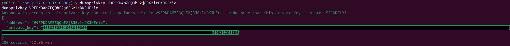

Then run the jar file:

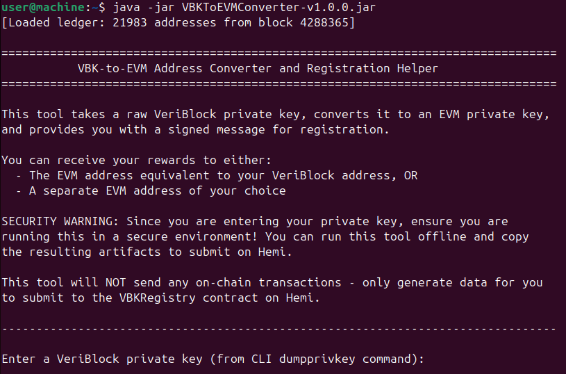

You will be prompted to enter your private key from the `dumpprivkey` command executed earlier. Paste it in, and press enter.

You will be prompted with several questions:

Question #1: What EVM address you would like to receive rewards to

Option 1. Use the EVM address derived from your VBK private key (the corresponding Ethereum-formatted private key will be provided later for you to import into a wallet like Metamask)

Option 2. Enter a different EVM address (linking your VBK address to another EVM address you are already using)

Question #2: Contract Configuration

Just accept the defaults -- Hemi network (43111) and the mainnet VBKRegistry contract address (0xA7402C49B8947901c5F8A7fcd9AacD820bAcdDdB).

Question #3: Registration versus Update

If you are registering this particular VBK address for the first timme, select "Register". Otherwise if you already registered this VBK address and wish to change your registered/linked EVM address, select "Update".

Question #4: Signature Deadline

This is an advanced feature to protect against replay attacks, leave the default of 8 hours unless you want to set a different timeout for your signature.

After you have selected your choices for the above options, you will be prompted to sign a message agreeing to VBK address registration terms:

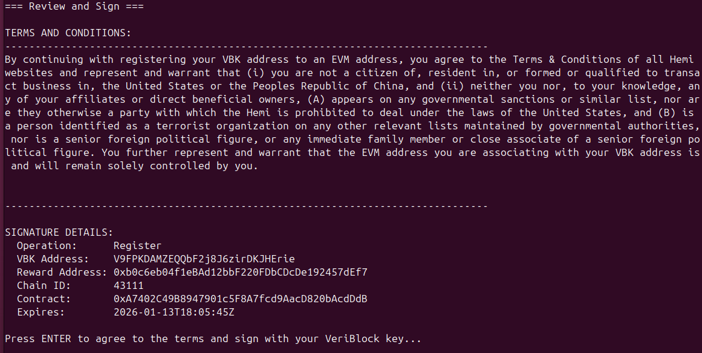

Afer you accept and sign, you will see Registration Paramters printed out:

These are the parameters for your selection and signature which need to be submitted to the smart contract. You can either submit the 7 fields separately (pubKeyX, pubKeyYT, v, r, s, rewardEVMAddress, deadline), or type "y" to generate packed data which only requires you to submit one serialized representation of these 7 fields but costs slightly more gas.

If you chose to use the EVM address derived from your VBK private key, the EVM-formatted private key will be displayed.

If you choose to generate the more convenient packed data representation, you will see the following:

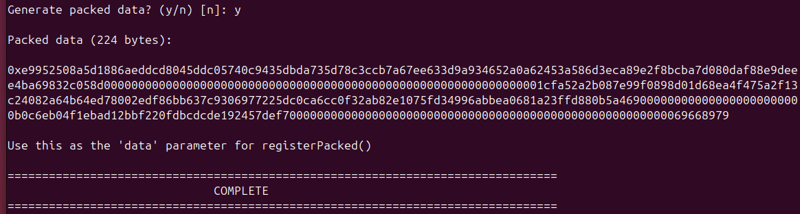

Now, navigate to the VBKRegistry contract on the Hemi Mainnet Explorer [Releases](https://explorer.hemi.xyz/address/0xA7402C49B8947901c5F8A7fcd9AacD820bAcdDdB). 

Click on the "Contract" tab:

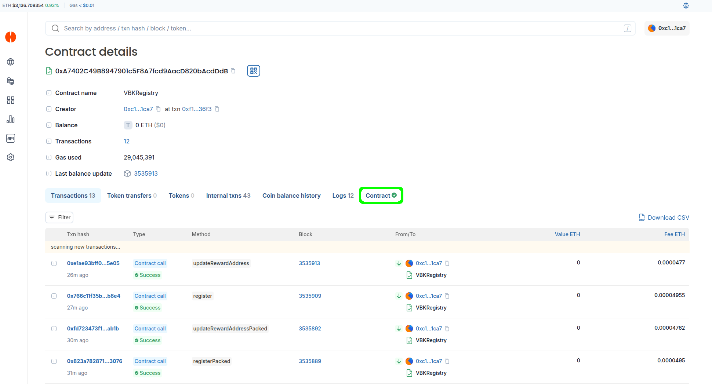

If you do not have an EVM address connected to Metamask, connect it now (can be any EVM address with ETH on Hemi Mainnet - does not have to be the same EVM address as you are registering your VBK address to):

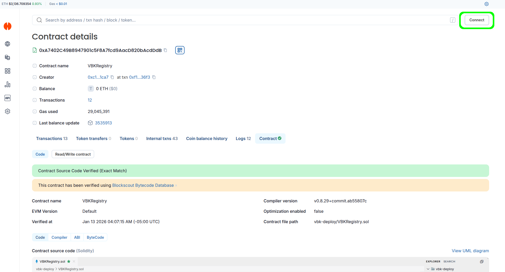

Select the wallet you are using (ex: Metamask):

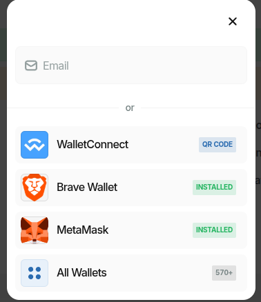

Confirm the connection: 

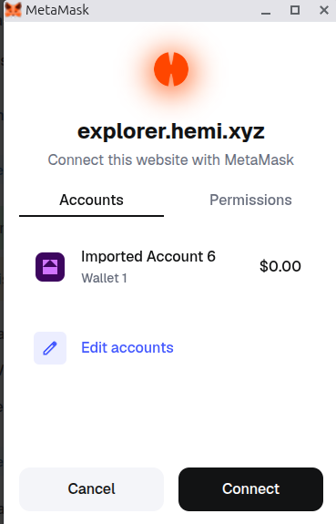

Now navigate to the "Read/Write contract" tab of the VBKRegistry contract on the explorer:

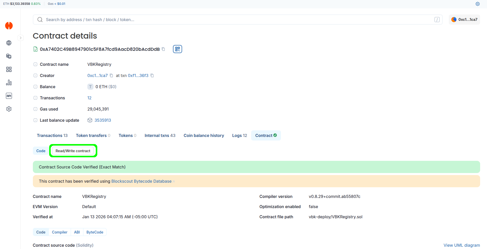

Then navigate to either the "register" or registerPacked" function and expand it, depending on whether you want to submit the full 7-parameter signature package or the serialized version. Fill out the data displayed in the VBK-to-EVM Address Converter program, then click the "Write" button:

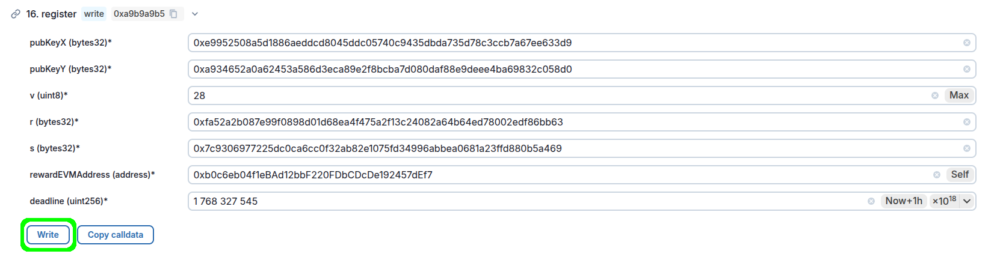

**OR**

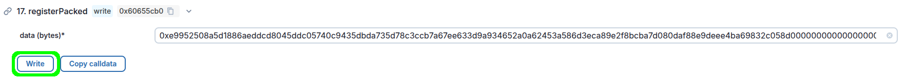

After you click "Write", if you have a wallet with ETH connected to the Explorer, you should see a Transaction Request or similar pop up prompting you to sign the transaction to submit your registration. Confirm the transaction:

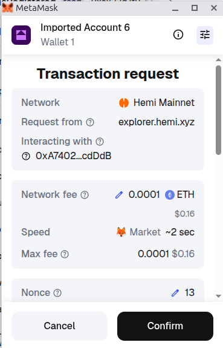

After the transaction is confirmed, you can navigate up to the "lookupVBKAddress" function and enter your VBK address to verify the registration was successful and resulted in the EVM address you expect:

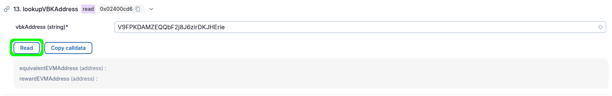

Click "Read":

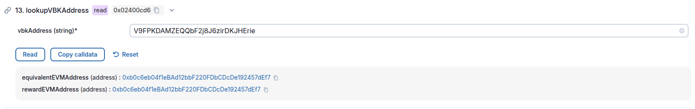

## Importing your EVM address derived from VBK key

If you chose to register your VBK address to the corresponding EVM address derived from your VBK private key, you will have been given the EVM version of the private key from the VBK-to-EVM Address Converter program. You can import this private key into any EVM wallet like Metamask. Here are instructions for doing that in Metamask:

First, Open Metamask, navigate to your "Accounts" page, and click "Add wallet":

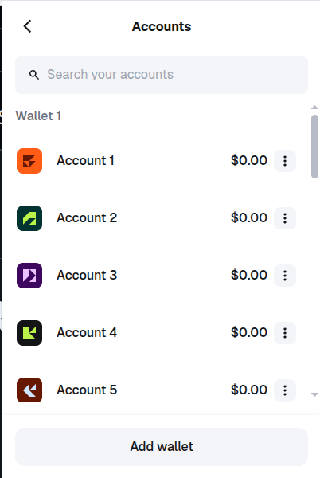

Then select "Import an account":

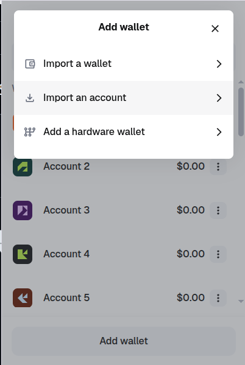

Enter the private key that was output by the VBK-to-EVM Address Converter program:

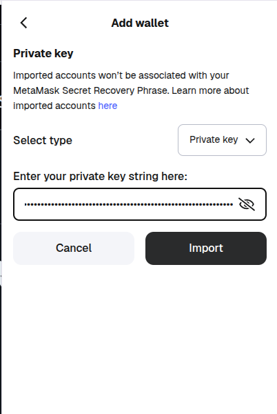

After the import, the new account will show up under "Imported Accounts":

To confirm the import worked as expected, click on the three dots to the right of the latest imported account, and select "Addresses":

The "Ethereum" address you see on the following page should match the EVM address displayed in the VBK-to-EVM Address Converter program:

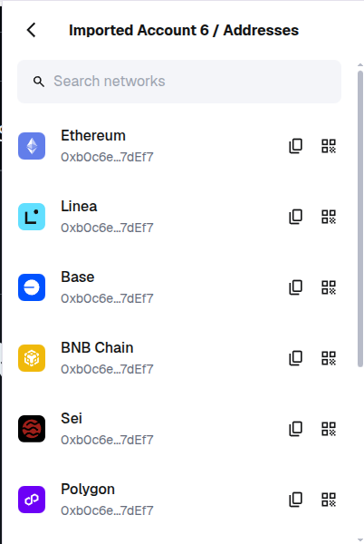

Note that you do NOT need to submit your registration using this address; you can submit the registration transaction on the Hemi explorer from any address that has ETH to pay transaction gas fees on Hemi Mainnet.
